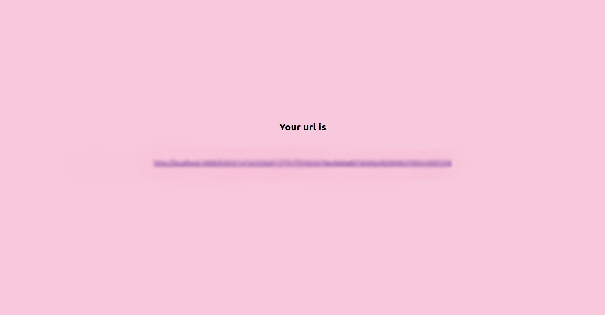

# Dater 🌹
## Welcome to **Dater Project**! This repository contains almost everything you need to create a charming invitation for your special someone.

  

## How to use
1. Start telegram bot [**@wannagooutbot**](https://t.me/wannagooutbot) to receive messages from it 💌

2. Go to the main page and enter your Telegram ID. It allows you to get an answer from your sweetheart. You can get your ID from [**@IDBot**](https://t.me/username_to_id_bot) 📝
    
    

3. Copy created link and send it to your romantic interest 🌷
    
    

4. Wait for the answer ⏳

   

## Mischievous «No» button
Tired of the mundane, immobile «No» buttons that seem to taunt you with their unyielding presence? Don't worry, our button evades the mouse cursor 😉

## Let the Romance Begin!
Send your invitation and get ready for a magical night! 🌟✨
